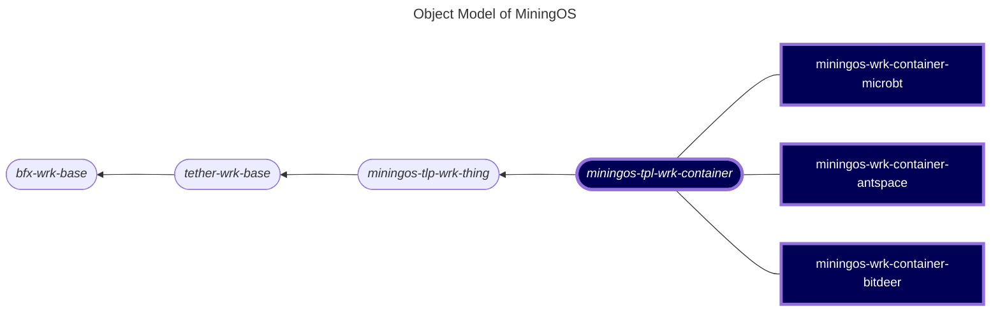

# miningos-tpl-wrk-container

A template worker for managing mining containers (Antspace, Bitdeer, Microbt) in the MiningOS infrastructure. This worker provides container-level control including power management, cooling systems, and socket control.

## Table of Contents
1. [Overview](#overview)
2. [Object Model](#object-model)
3. [Requirements](#requirements)
4. [Configuration](#configuration)
5. [Container Control Features](#container-control-features)
6. [API Methods](#api-methods)

   
## Overview

The Container Worker extends the MiningOS Thing Worker framework to provide specialized functionality for managing mining containers. It handles:

- Container power management
- Cooling system control
- Individual socket/PDU control
- Real-time statistics collection
- Alert monitoring

## Object Model

The following is a fragment of [MiningOS object model](https://docs.mos.tether.io/) that contains the concrete classes representing **Container miners workers** (highlighted in blue), one generically representing any model of the brand, and four children specifically representing brands. The rounded nodes reprsent abstract classes and the square nodes represents a concrete classes:



> Accordign to UML notation, abstract classes have their names in Italic. 'Stadium shape' applied for abstract class nodes for better visualization.

> Horizontal display was chosen over more conventional vertical one merely for purposes of better layout.

Check out [miningos-tpl-wrk-thing](https://github.com/tetherto/miningos-tpl-wrk-thing) for more information about parent and sibling classes.

## Requirements

- Node.js >= 20.0
- Dependencies from `miningos-tpl-wrk-thing`
- Network access to container control systems

## Configuration

### Base Configuration (`config/base.thing.json`)

```json
{
  "_idFile": "",
  "collectSnapsItvMs": 60000,      // Snapshot collection interval (ms)
  "logRotateMaxLength": 10000,     // Maximum log entries before rotation
  "logKeepCount": 3                // Number of log files to retain
}
```

### Common Configuration (`config/common.json`)

```json
{
  "dir_log": "logs",    // Log directory path
  "debug": 0            // Debug mode (0=off, 1=on)
}
```

### Additional Configuration Files

- `config/facs/miningos-net.config.json` - Network configuration
- `config/facs/net.config.json` - General network settings
- `config/facs/store.config.json` - Storage configuration


## Container Control Features

### Power Management

- **Switch Container**: Turn entire container on/off
- **Socket Control**: Control individual power sockets/PDUs
- **Batch Operations**: Control multiple sockets simultaneously

### Cooling System

- **Switch Cooling**: Turn cooling system on/off
- **Temperature Monitoring**: Track ambient temperature
- **Humidity Monitoring**: Monitor humidity levels
- **Alarm Management**: Handle and reset cooling system alarms TODO: check actual implementation of `async resetAlarm ()`

### Statistics Collection

The worker collects the following statistics:

- **Power Consumption** (`power_kw`): Current power usage in kilowatts
- **Ambient Temperature** (`ambient_temp_c`): Container temperature in Celsius
- **Humidity** (`humidity_percent`): Relative humidity percentage
- **Alarm Status** (`alarm_status`): Boolean indicating alarm state

Collection intervals:
- Real-time data (RTD): Every 30 seconds
- 20-second snapshots: Every 20 seconds
- 1-minute aggregations: Every minute
- Standard intervals from base worker (5m, 30m, etc.)

## API Methods

### Container Operations

#### `switchContainer(enabled: boolean)`
Enable or disable the entire container.

#### `switchSocket(args: Array<[pduIndex: string, socketIndex: string, enabled: boolean]>)`
Control individual sockets. Accepts batch operations.

#### `switchCoolingSystem(enabled: boolean)`
Control the container's cooling system.

### Query Methods

#### `getStats()`
Returns current container statistics including power, temperature, humidity, and alarm status.

#### `getConfig()`
Returns the current container configuration.

#### `getSnap()`
Returns a complete snapshot including both stats and configuration.
